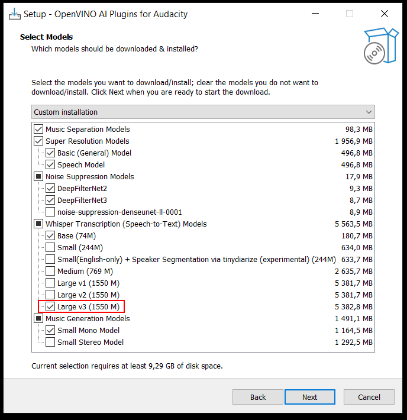
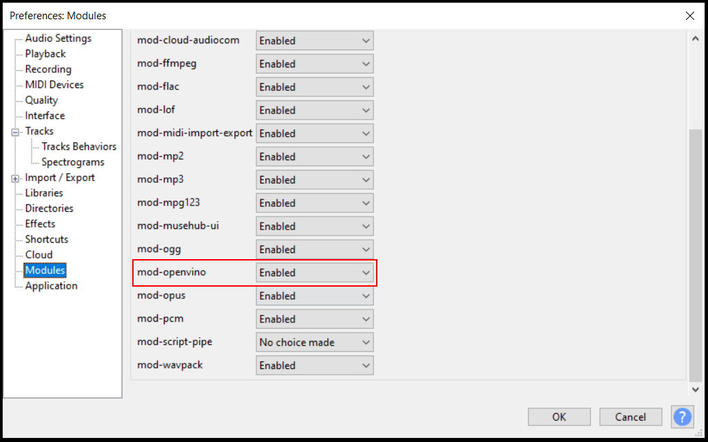
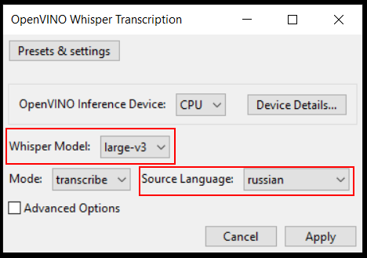

# Transcribe audio to text

This instruction will help you transcribe audio to text using the Audacity tool.

## Requirements 
1. Operating system: Windows.  
2. Programs: installed Audacity, OpenVINO plugin and FFmpeg (instructions below)  
3. Internet access to download utilities.  
4. Administrator rights (requires installation in system folders).  
5. Disk: enough free space for files (high resolution models can be large).

## Instructions
- Download audacity-win-<version>-64bit.exe from the latest release https://github.com/audacity/audacity/releases/latest  
[Mirror on GitHub](https://github.com/gamelton/Transcribe-audio/releases/download/v1.0/audacity-win-3.7.3-64bit.exe)
- Download ffmpeg-{version}-full_build-shared.zip from the latest release https://github.com/GyanD/codexffmpeg/releases/latest  
[Mirror on GitHub](https://github.com/gamelton/Transcribe-audio/releases/download/v1.0/ffmpeg-7.1.1-full_build-shared.zip)
- Download audacity-win-<version>-64bit-OpenVINO-AI-Plugins.exe from the latest release https://github.com/intel/openvino-plugins-ai-audacity/releases/latest  
[Mirror on GitHub](https://github.com/gamelton/Transcribe-audio/releases/download/v1.0/audacity-win-v3.7.1-R4.2-64bit-OpenVINO-AI-Plugins.exe)
- Install Audacity by running audacity-win-<version>-64bit.exe
- Extract ffmpeg-{version}-full_build-shared.zip to C:\Program Files\ffmpeg\ folder.  
- Open a command line (`Win + R` → `cmd`) and set the ffmpeg environment variable.
    ```
    setx /M PATH "%PATH%;C:\Program Files\ffmpeg\bin"
    ```
- Install OpenVINO plug-in by running audacity-win-{version}-64bit-OpenVINO-AI-Plugins.exe  
For better recognition, choose a larger model. The bigger the model, the longer it will take to recognize.  
 
- Configure Audacity to use ffmpeg, for format support.  
In Audacity, choose `Edit` → `Preferences` → `Libraries` → `Locate` and specify the folder with the unzipped `ffmpeg\bin\avformat-61.dll`.
- Enable the OpenVINO module in Audacity  
Enable the module in Audacity `Edit` → `Preferences` → `Modules` → `mod-openvino: Enabled`  
 
- Open the audio file (`File` → `Open`) or record the vocals in Audacity  
- Recognize audio to text in Audacity 🎤→📝   
Highlight the whole track (Ctrl+A) or the desired fragment `Analyze` → `OpenVINO Whisper Transcription`. Select the appropriate recognition model and speech language. The recognition accuracy depends on the audio quality and the selected Whisper model.  

- Save the text to a file  
After transcription, the text will appear as Labels on the track. Export the text by selecting Transcription under the audio track and click `File` → `Export` → `Export Labels...`.


[Source 1](https://medium.com/illumination/how-to-transcribe-audio-to-text-using-audacity-for-free-f027b4a5a240)  

[Source 2](https://admin.kuleuven.be/icts/english/research/datamgmtpract/transcribe/transcription_audacity)
